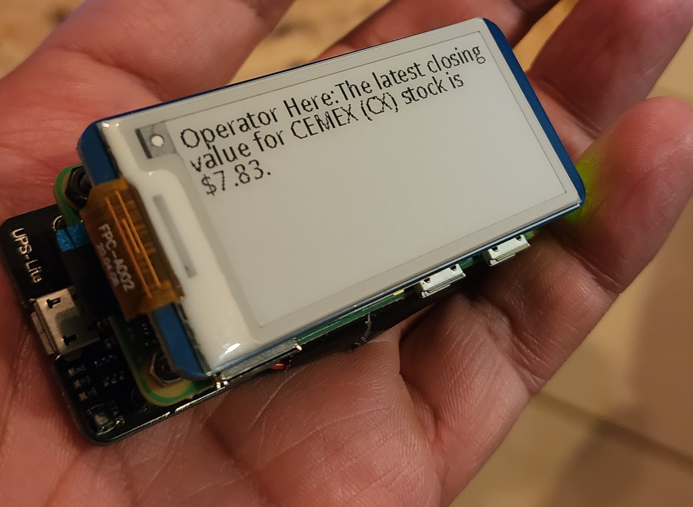

# AutoBerryPi Repository

Welcome to the AutoPiCoder repository, where the Raspberry Pi meets automation, thanks to the power of Autogen. This repository is a treasure trove of scripts and tools designed to supercharge your Pi with self-programming capabilities.

## Repository Contents

### AutoPiCoder Folder
This is the heart of the operation. Inside, you'll find the core files that turn your Raspberry Pi into a coding wizard. The AutoPiCoder leverages Autogen to program Python and bash scripts, evolving with each task. It's like having a little robot that learns to code on its own.

### scriptswithOperator
Dive into this folder to discover the operator script, a key piece that takes in messages and showcases them on the 2.13" eInk screen from Waveshare. It's a work in progress, with examples of agents relaying their discoveries to the operator. While not every use case is a homerun yet, it's getting there.

### wifi daemon
Need your Pi to be savvy about WiFi networks? The `autoBerryPi` script in this folder does just that. With a properly formatted `"/RelicConf/wificonf.txt"` file, it updates the WiFi configurations so your Pi can hop onto the right network whenever you shift places.

## Overview

We've put Autogen through its paces here, challenging it to create scripts that handle WiFi management, display messages, and even write new scripts. After some clever prompts and a couple of 'Enter' hits, we've got a set of tools that enhance the Pi's functionality significantly. 

## What's Next?

While we're proud of the strides we've made, the journey doesn't end here. Here's what's on the docket for future updates:

- **Microphone Support**: We're looking to go hands-free by adding voice input capabilities. Imagine dictating commands to your Pi and watching it spring into action.
- **Drive Repository Connection**: To streamline the workflow, we plan to connect the Pi to a drive repository. This way, every piece of code and every note gets backed up and accessible from anywhere.
- **Speaker Support**: Because why should communication be a one-way street? With text-to-voice, we aim for the Pi to talk back, making our interactions with it more dynamic and informative.

Stay tuned as we continue to expand the Pi's horizons. Your feedback and contributions are welcome as we build towards these exciting enhancements!

